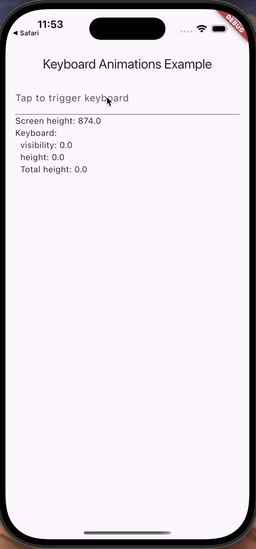
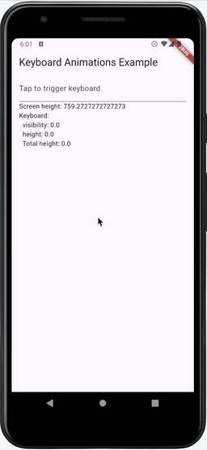
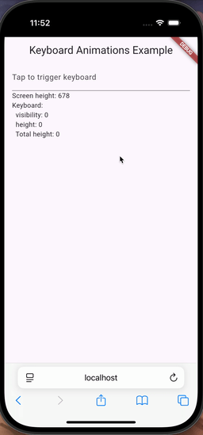

# Keyboard Notification

This package aimed to solve 2 problems:

1) Animate your custom UI in sync with the keyboard animation
2) Getting system notification when keyboard start/finish the animation, and it's height


| iOS | Android | Web |
| ------------- | ------------- | --- |
|   |   |  |


## Animate in sync with keyboard

To animate your UI together with the keyboard use `KeyboardAnimatedBuilder` widget.

Here are some options how you can use it:

Option 1: Builder-like approach

```dart
KeyboardAnimatedBuilder(
  builder: (context, keyboard, child) {
    return Positioned(
      bottom: (keyboard.totalHeight + 20) * keyboard.visibility,
      left: 0,
      right: 0,
      child: Opacity(
        opacity: keyboard.visibility,
        child: Container(
          height: 40,
          color: Colors.lightBlueAccent,
          child: Center(child: Text('Toolbar')),
        ),
      ),
    );
  },
)
```

Option 2: Use onChange callback to change other widgets manually:

```dart
KeyboardAnimatedBuilder(
  onChange: (keyboard) {
    // Calc custom position based on keyboard.visibility or keyboard.animation
    final position = ...
    scrollController.jumpTo(position)  
  },
  child: ...,
),
```

Option 3: Combine both options:

```dart
KeyboardAnimatedBuilder(
  onChange: (keyboard) {
    // Calc custom position based on keyboard.visibility or keyboard.animation
    final position = ...
    scrollController.jumpTo(position)
  },
  builder: (context, keyboard, child) {
    return Positioned(
      bottom: (keyboard.totalHeight + 20) * keyboard.visibility,
      left: 0,
      right: 0,
      child: child,
    );
  },
  child: HeavyWidget(...)
)

```


## Getting notification about keyboard animation

To get notification, just create new `KeyboardObserver` instance and add a listener (don't forget to dispose)

```dart
  final observer = KeyboardObserver();

  @override
  void initState() {
    observer.addListener(_onKeyboardNotification);
    super.initState();
  }

  @override
  void dispose() {
    observer.dispose();
    super.dispose();
  }


  void _onKeyboardNotification(KeyboardNotification note) {
    if (note is KeyboardAnimationStartNotification) {
      // Keyboard will appear/disappear
    } else if (note is KeyboardAnimationEndNotification) {
      // Keyboard did appear/disappear
    }
  }
```

## Widgets Testing

Keyboard appearing/disappearing and animations testing is limited in Flutter, as it doesn't automatically shown
during text field editing, and even `showKeyboard` method doesn't adjust bottom insets, in case we want to
see how keyboard affect our layout.

To deal with that issue, we can use folloing extension to `WidgetTester` that can simulate keyboard notifications and bottom insets:
```dart
extension KeyboardTester on WidgetTester {
  void setKeyboardVisible(bool visible, {double? height}) {
    double keyboardHeight = height ?? (view.physicalSize.height * 0.4);
    KeyboardAnimationStartNotification(
      visible: visible,
      height: keyboardHeight,
    ).post();
    view.viewInsets = FakeViewPadding(bottom: keyboardHeight);
    KeyboardAnimationEndNotification(
      visible: visible,
      height: keyboardHeight,
    ).post();
  }
}
```
It also works well together with `KeyboardAnimatedBuilder`.

Just use as `tester.setKeyboardVisible(true);`

Example:

```dart
    tester.setKeyboardVisible(true);
    await tester.pumpAndSettle();
```

## Technical details

### Animation curves and duration

I've tried to find a right Curve and duration, but after many tries I found:

* Both Android and iOS doesn't report their Curves, as bezier params. Even if we do fitting into Bezier or create a Curve as set of experimental gathered points - it won't work as expected. 
* Even if we get Curve which is really close to native one - it's hard to sync animation in Flutter with native keyboard animation. The problem that animation start and duration is not precisely correct. For instance in iOS keyboard notifications reports 250ms for animation duration, while empirically it's between 430 to 450ms (but duration between "will" and "did" notifications is 500ms).

But closest results can be achieved relying on Flutter's `viewInsets.bottom` changes. That's why `KeyboardAnimatedBuilder` is based on `WidgetsBindingObserver` and `KeyboardObserver` (to filter changes that are not related to keyboard, and to know total keyboard height).

### Android version 

Android plugin uses modern API `setWindowInsetsAnimationCallback` on Android API 30+ and fallbacks
to old `addOnGlobalLayoutListener` for older versions.

### iOS version

iOS plugin uses native `keyboardWillShowNotification`, `keyboardWillHideNotification`, `keyboardDidShowNotification` and `keyboardDidHideNotification`
notifications 

### Web version

Relies on Flutter built-in `View.of(context).viewInsets.bottom`. It doesn't animate, but updates UI after keyboard appeared/disappeared. 


